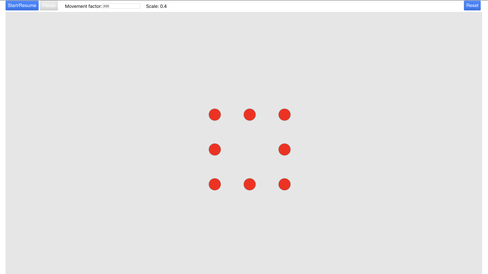

# Particles
Sample project using react, react-konvas, simple-flexbox

# How to run

1. Clone or download repo: https://github.com/osielmesa/particles.git.
2. Open terminal and cd into project folder.
3. Install dependencies using `npm install` command.
4. Run the project using `npm start` command.
5. Go to your browser and find (if open automatically) or open this url: http://localhost:3000/

# Screenshot

&nbsp;&nbsp;&nbsp;&nbsp;&nbsp;&nbsp;
